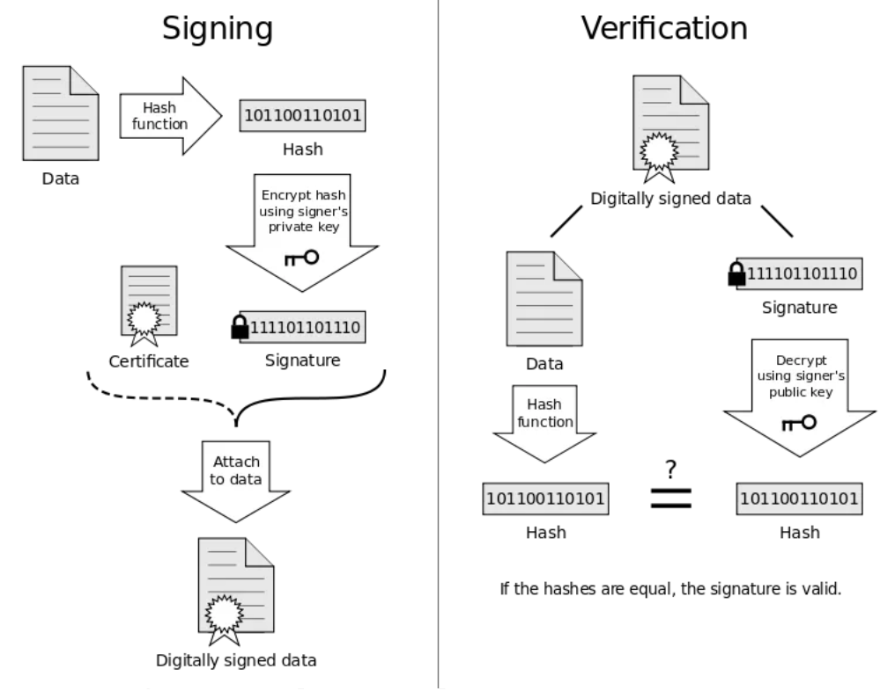

# Projecto de Criptografia Aplicada (TP1)

Este relatório é relativo ao trabalho prático nº 1 da UC Segurança de Sistemas Informáticos realizado por:
- Rodrigo Monteiro, a100706
- Diogo Abreu, 100646

No qual é construído um serviço de _Message Relay_ que permite aos membros de uma organização trocarem mensagens com garantias de autenticidade.

# Estrutura do código


## Packets 

### `packets.py`

Primeiramente, decidimos definir estruturas de dados genéricas para os pacotes que são enviados entre os clientes e o servidor, e que fazem parte do protocolo definido.

Portanto, definimos as classes `PacketType` e a classe `Packet` que possui um `PacketType` como atributo.

```python
class PacketType(IntEnum):  
    @abstractmethod  
    def __str__(self) -> str:  
        return self.name  
  
  
class Packet:  
    def __init__(self, packet_id: int, packet_type: PacketType): 
        self.id = packet_id  
        self.type = packet_type
```

Para além disso, contém também superclasses base para as subclasses de serialização e deserialização de _packets_ (como `ClientPacketSerializer` e `ServerPacketSerializer`).

```python
class PacketSerializer:  
    @staticmethod  
    @abstractmethod    
    def serialize(packet: Union[Type[Packet], Packet]) -> bytes: 
        raise NotImplementedError  
  
class PacketDataDeserializer:  
    @staticmethod  
    @abstractmethod    
    def deserialize(data: bytes) -> Union[Type[Packet], Packet]: 
        raise NotImplementedError
```

Assim, os métodos de serialização e deserialização serão agrupados em classes próprias.  Caso os métodos fossem implementados nas subclasses de `Packet`, estes seriam úteis se fossem `static`, o que não resultaria com herança, e levaria a repetição de código.

Também possui as classes `EncryptedPacketSerializer`, e `EncryptedPacketDeserializer`, que serão explicadas posteriormente.

### `client_packets.py`

Contém diversas classes que definem os pacotes do protocolo usado. Exemplo:
```python
class ClientPacketType(PacketType):  
    ASK_QUEUE = 1  
    # ...

class ClientAskQueuePacket(Packet):  
    def __init__(self, packet_id: int) -> None:  
        super().__init__(packet_id, ClientPacketType.ASK_QUEUE)

class ClientPacketSerializer(PacketSerializer):  
    @staticmethod  
    def serialize(packet: Packet) -> bytes:
		format_string = '!BH'  
		flat_data = [packet.type.value, packet.id]  
  
		match packet.type:  
		    case ClientPacketType.ASK_QUEUE:   
		        return ClientPacketSerializer
		        ._serialize_ask_queue(format_string, flat_data)
```

- **`SEND`**:  
	- `UID` do cliente a quem se envia a mensagem 
		- *max length*: 255 bytes
	- `subject` 
		- *max length*:  255 bytes 
	- `body`
		- *max length*: 65535 bytes)
	- `signature` da mensagem a enviar (UID, subject e body) com a chave RSA privada 
		- *max length*: 65535 bytes
	- `encrypted_symmetric_key`: uma chave simétrica é gerada e utilizada para encriptar a mensagem a enviar (subject e body), sendo depois enviada mas encriptada com a chave pública do cliente a quem se envia a mensagem
		- *max length*: 65535 bytes
- **`ASKQUEUE`**: (sem informação adicional)
- **`GET_MSG`**: 
	- `msg_num`: número da mensagem na _queue_ (4 bytes)
- **`PARAMS`**: 
	- `params`: parâmetros para a geração de chaves DL 
		- *max length:* 65535 bytes
- **`PUBLIC_KEY`**: 
	- `public_key`
		- *max length:* 65535 bytes
- **`HANDSHAKE`**:  
	- `signature`; 
		- *max length:* 65535 bytes
	- `certificate` com a chave pública para verificação da assinatura;
		- *max length:* 65535 bytes
	- `salt`: são usados 16 bytes aleatórios, mas podem ser usados até 255 bytes
- **`GET_CERT`**: 
	- `UID` de um cliente
		- *max length:* 65535 bytes

### `server_packets.py`

- **`QUEUE_INFO`**: 
	- `state`:  *empty* ou *not empty* (1 byte)
	- `num_elements`: caso o estado seja `not empty` (4 bytes)
- **`QUEUE_ELEMENT`**: pacotes seguidos do `QUEUE_INFO`
	- `msg_num`: 4 bytes
	- `sender_uid`:
		- *max length*: 255 bytes
	- `timestamp`: 4 bytes
	- `subject`:
		- *max length*: 65535 bytes
	- `encrypted_symmetric_key`:
		- *max length*: 65535 bytes
- **`MSG`**: enviado em resposta a um pedido `GET_MSG` de um cliente
	- `status`: *ok*, *not_found*
	- `sent_by`:
		- *max length*: 255 bytes
	- `timestamp`: 4 bytes
	- `subject`: *encrypted*
		- *max length*: 255 bytes
	- `body`: *encrypted*
		- *max length*: 65535 bytes
	- `signature`
		- *max length*: 65535 bytes
	- `cert` do cliente que enviou a mensagem
		- *max length*: 65535 bytes
	- `encrypted_symmetric_key`
		- *max length*: 65535 bytes
- **`STATUS`**: 
	- `status`: *ok* ou *error* (1 byte)
- **`HANDSHAKE`**: 
	- `public_key`: 
		- *max length* 65535 bytes
	- `signature`: 
		- *max length*  65535 bytes
	- `certificate`: 
		- *max length* 65535 bytes
- **`SEND_CERT`**:
	- `certificate`: 
		- *max length* 65535 bytes

## Funcionamento básico do `msg_server.py`

O Server funciona com um socket TCP do tipo `SOCK_STREAM`, e cria uma _thread_ por cada conexão com um cliente.

```python
def run(self) -> None:  
    self.print('Starting server ...')  
  
    self.sock = socket.socket(socket.AF_INET, socket.SOCK_STREAM)  
	# ...
    while not self.done:  
        try:  
            client, address = self.socket.accept()  
            thread = Thread(target=self.listen_to_client, 
				            args=(client, address))  
            self.threads.append(thread)  
            thread.start()  
        except socket.timeout:
	        # ...
```

Para além disso, possui as classes:
- `Message`: guarda as mensagens recebidas pelos clientes, para depois as redirecionar para os clientes corretos, quando estes realizam o comando `askqueue` ou `getmsg`.
- `ClientMessages`:  dá IDs às mensagens - usados no comando `getmsg` - e mantém um dicionário de mensagens lidas e outro de mensagens não lidas em que chaves são os IDs e os valores são as mensagens.

```python
self.msgs: Dict[str, ClientMessages] = defaultdict(ClientMessages)
```

```python
class ClientMessages:  
    def __init__(self) -> None:  
        self.read_msgs: Dict[int, Message] = {}  
        self.unread_msgs: Dict[int, Message] = {}  
        self.next_id: int = 0
    def add_unread_msg #...
    def read_unread_msg(self, num: int) -> Message | None: # ...
```

## Funcionamento básico do `msg_client.py`

- Função `main`
	- Esta função lê os argumentos passados ao programa e executa os métodos necessários - que são estáticos e encontram-se na classe `ClientController`. Exemplo:
	```python
	if len(argv) > 1 + p and argv[1 + p] == 'askqueue':  
	    c = Command(Command.Type.ASK_QUEUE, [])
	
	# ...
	
	client_thread = Thread(target=client.run)  
	client_thread.start()
	
	match c.command_type:  
		 ClientController.get_queue_elements(client)
	```
	- Caso os argumentos estejam errados, imprime um erro para o `sys.stderr`. Caso não possua argumentos entra num modo de "terminal", correndo o `ClientController`
	
- Classe `ClientController`

```python
class ClientController:  
    def __init__(self,  msg_client: Client) -> None:  
        self.commands = # ...
  
    def run(self) -> None:  
        while not self.done and not self.client.done:  
            try:  
                command = input('> ').strip()  
                if self.done:  
                    break  
                self.parse_command(command)  
            except KeyboardInterrupt:
	             # ...

	def parse_command(self, command: str):  
	    for regex, func in self.commands:  
	        if match := regex.match(command):  
	            func(match)  
	            return
	            
	@staticmethod  
	def send_msg(client: Client, send_to: str, subject: str, 
	body: str, timeout: int = 3) -> None:
		# ...
	@staticmethod  
	def get_asked_msg(client: Client, timeout: int = 3) -> None:
		# ...
	@staticmethod  
	def check_lengths(subject: str, body: str) -> bool:
		# ...
	@staticmethod  
	def get_queue_elements(client: Client, 
	timeout_info: int = 3, timeout_element: int = 3) -> None:
		# ...
```
> Os métodos são estáticos de modo a que possam ser usados fora do modo de "terminal"

- Classe `Client`
	- Ao iniciar, conecta ao servidor, efetua o *handshake*, e de seguida fica a ler os *packets* enviados pelo servidor, deserializando-os. Também possui métodos para tratar dos pacotes recebidos, e para enviar pacotes.

```python
while not self.done:  
    try:  
        p = EncryptedPacketDeserializer.deserialize(
	        self.socket, self.handshake_info.aes_key,
	        self.handshake_info.hmac_key,
	        ServerPacketDataDeserializer
        )
	# ...
```


# *Handshake* inicial


- Pode-se confiar na chave pública do Server, por exemplo, pois esta está no certificado enviado que é comprovado por uma _trusted third party_, CA.
- Caso, por exemplo, a chave pública do servidor (DL) for modificada no caminho, esta não será igual à que está na assinatura e, portanto, não será possível validar a assinatura.
- Assim, para além de um _intruder_ nunca conseguir saber qual é a chave partilhada, também não conseguirá realizar ataques de *man-in-the-middle*.
- Com recurso à KDF utilizada, foram pedidos mais 32 bytes para se obter uma chave simétrica para o MAC - nunca se devem reutilizar chaves criptográficas para fins distintos.
- Decidimos incluir o salt na assinatura, para assegurar que este não é modificado - e caso seja, é detetado -  e que assim o cliente e o servidor chegam de certeza à mesma chave. Alternativamente, o cliente poderia encriptar o salt com a chave pública do servidor, e tal seria possível pois o salt neste caso é de pequena dimensão.

# Confidencialidade e Integridade

Para assegurar a confidencialidade (em relação ao "exterior") e integridade dos pacotes enviados entre os clientes e o servidor, é utilizado *encrypt-then-mac* (onde os bytes passam originalmente pela cifra, e o MAC é calculado já sobre o criptograma):

1. Serializar o pacote e gerar um NONCE
3. Utilizar AES no modo CTR para encriptar o pacote
4. Calcular o MAC utilizando o HMAC, definido sobre a função de hash `SHA256`, do NONCE + pacote encriptado
5. Enviar o NONCE + pacote encriptado +  MAC

```python
class EncryptedPacketSerializer:  
    @staticmethod  
    def serialize(packet: Packet, aes_key, hmac_key, serializer:
     Type[PacketSerializer], private_key=None, public_key=None):

        packet_bytes = serializer.serialize(packet,
		        private_key=private_key, public_key=public_key)  
        nonce = os.urandom(16)  
    
        algorithm = algorithms.AES(aes_key)  
        cipher = Cipher(algorithm, modes.CTR(nonce))  
        encryptor = cipher.encryptor()  
  
        encrypted_packet = encryptor.update(packet_bytes) 
					        + encryptor.finalize()  
        len_encrypted_packet = struct.pack('!I', 
							len(encrypted_packet))  
  
        h = hmac.HMAC(hmac_key, hashes.SHA256())  
        h.update(nonce + len_encrypted_packet 
				 + encrypted_packet)  
        tag = h.finalize()  
  
        return nonce + len_encrypted_packet + encrypted_packet 
		        + tag
```

# Comando `send`

Primeiramente, é necessário pedir o certificado do cliente, a quem se quer enviar a mensagem, ao servidor e validar esse certificado. De seguida, é enviada a mensagem, através de alguns passos.

Objetivos:
- **Autenticidade através da assinatura**
- **Confidencialidade (perante um servidor "curioso") através de um [hybrid cryptosystem](https://en.wikipedia.org/wiki/Hybrid_cryptosystem)**

Passos:
1. Serializar a mensagem (UID, *subject* e *body*)
2. Assinar a mensagem com a própria chave privada de modo a garantir autenticidade, gerando uma assinatura
3. Gerar uma chave simétrica (com [`Fernet`](https://cryptography.io/en/stable/fernet/ ))
4. Encriptar o *subject* e o *body* com a chave simétrica
5. Encriptar a chave simétrica gerada com a chave pública do cliente a quem se envia a mensagem
6. Enviar a mensagem serializada com o *subject* e o *body* encriptados, juntamente com a assinatura, e com a chave simétrica encriptada

```python
def sign_msg(private_key_rsa, peer_public_key, uid: str,
			 subject: str, body: str) -> bytes:  
			 
    msg_bytes = CentralizedEncryption._serialize_msg(...)  
    sig = CentralizedEncryption.sign_bytes(private_key_rsa,
										    msg_bytes)  
	# ...
    symmetric_key = Fernet.generate_key()  
    f = Fernet(symmetric_key)  
    encrypted_symmetric_key = CentralizedEncryption
			    .encrypt_bytes(peer_public_key, symmetric_key)  
  
    encrypted_subject = f.encrypt(subject_bytes)  
    encrypted_body = f.encrypt(body_bytes)  
  
    serialized_msg_bytes = CentralizedEncryption
			    ._serialize_msg(uid_bytes, encrypted_subject,
							    encrypted_body)  
  
    return serialized_msg_bytes + len_and_sig 
		    + len_and_enc_sym_key
```


> _Source:_ [_https://en.wikipedia.org/wiki/Electronic_signature_](https://en.wikipedia.org/wiki/Electronic_signature)

# Comando `getmsg`

1. Validar certificado
2. Validar assinatura
	1. Desencriptar chave simétrica com a própria chave privada
	2. Desencriptar o *subject* e o *body* utilizando a chave simétrica
	3. Serializar a mensagem novamente com os dados desencriptados de modo a se poder validar a assinatura
	```python
	def verify_signed_msg(public_key_rsa, private_key, 
	uid: bytes, subject, body, sig, f_key):  
	
	    symmetric_key = CentralizedEncryption
			.decrypt_bytes(private_key, f_key) 
			 
	    f = Fernet(symmetric_key)  
	    decrypted_subject = f.decrypt(subject)  
	    decrypted_body = f.decrypt(body)  
	    msg_bytes = CentralizedEncryption
			._serialize_msg(uid, decrypted_subject,
							decrypted_body)
			  
	    if not CentralizedEncryption
		    .verify_signature(public_key_rsa, sig, msg_bytes):  
	        return None  
	    else:  
	        return decrypted_subject, decrypted_body
	```

# Comando `askqueue`

Quando é enviado um pacote `ASKQUEUE` o servidor responde sempre primeiro com um pacote do tipo `QUEUE_INFO` de modo a informar se a *queue* está vazia ou não, e, se não estiver, informa também acerca do tamanho da *queue*, i.e., dos pacotes que irá então mandar.

```python
def get_queue_elements(client: Client, timeout_info: int = 3,
					   timeout_element: int = 3) -> None:  
    client.send_ask_queue_packet()  
    queue_info: ServerQueueInfoPacket = client
		.responses['queue_info']
	    .get(timeout=timeout_info, block=True)
	      
    if queue_info.state == ServerQueueInfoPacket.State.EMPTY:  
        return  
  
    count = 0  
    queue_elements = []  
    while count < queue_info.num_elements: 
	    try: 
			e: ServerQueueElementPacket = client
				.responses['queue_elements']
				.get(timeout=timeout_element, block=True)
		except Empty:
			break 
	# ...
```

# Funcionamento

- Comandos (Servidor)


- Comandos (Cliente)


- Exemplo de utilização (1)


- Exemplo de utilização (2)


# Conclusões

Para concluir, achamos que este trabalho prático foi uma boa oportunidade para finalmente aplicar criptografia em protocolos de comunicação entre clientes e servidor, aproveitando também conhecimentos adquiridos noutras UCs como Comunicações por Computador e Sistemas Distribuídos.

# Referências

- https://cryptography.io/en/stable/fernet/ 
- https://cryptography.io/en/latest/hazmat/primitives/asymmetric/rsa/#encryption
- https://en.wikipedia.org/wiki/Hybrid_cryptosystem
- https://security.stackexchange.com/questions/27776/block-chaining-modes-to-avoid/27780#27780
